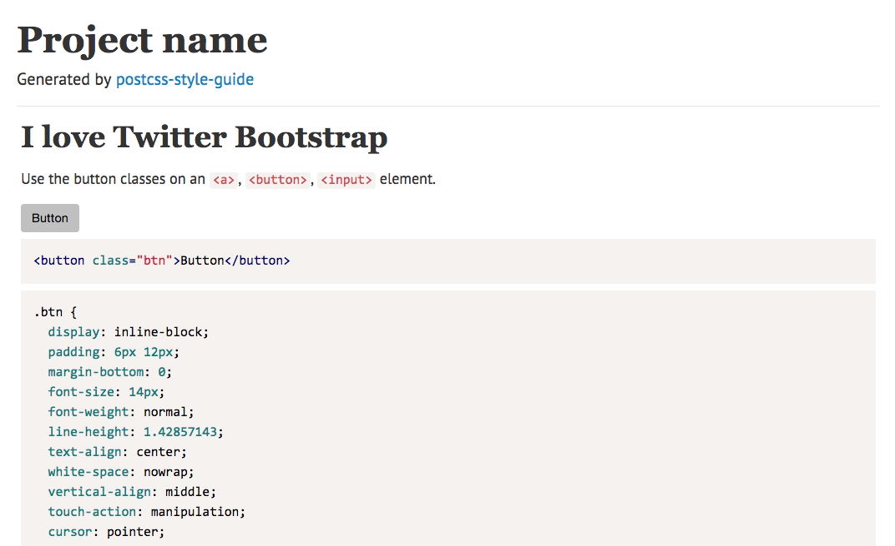

# psg-theme-1column

Single grid theme of [postcss-style-guide](https://github.com/morishitter/postcss-style-guide)

## Install

```shell
$ npm install psg-theme-1column
```

## Theme



### sample

It's details of the above.

```
/*
@styleguide

# Overview

1 column theme of postcss-style-guide

## Buttons

Use the button classes on an `<a>`, `<button>`, `<input>` element.

<button class="btn">Button</button>

    <button class="btn">Button</button>

*/
.btn {
  display: inline-block;
  padding: 6px 12px;
  margin-bottom: 0;
  font-size: 14px;
  font-weight: normal;
  line-height: 1.42857143;
  text-align: center;
  white-space: nowrap;
  vertical-align: middle;
  touch-action: manipulation;
  cursor: pointer;
  user-select: none;
  background-image: none;
  border: 1px solid transparent;
  border-radius: 4px;
}
.btn:hover,
.btn:focus,
.btn.focus {
  color: #333;
  text-decoration: none;
}
```

## License

The MIT License (MIT)

Copyright (c) 2015 Shin Sekaryo
